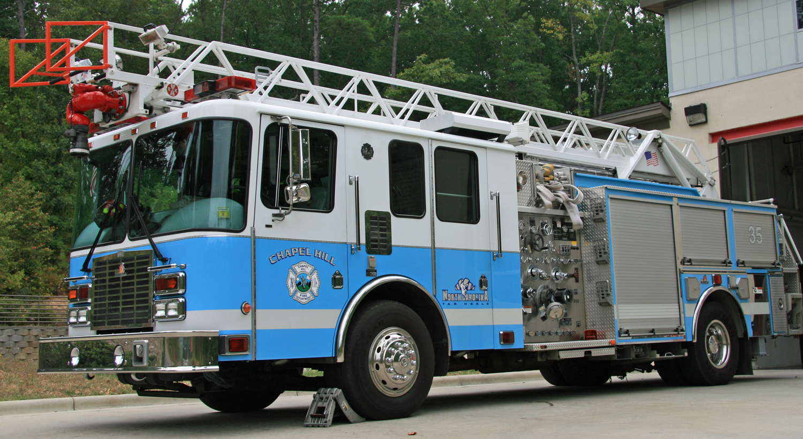
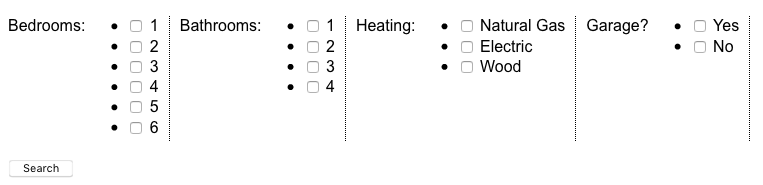
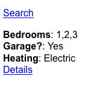
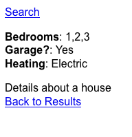
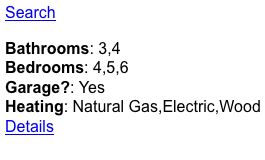
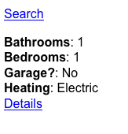

# A different Form of navigation
## Chaim Kirby
### DjangoCon Europe 2018

^This morning I'm going to talk about forms. Forms are great. A contact page, django admin, site signup? Use a form! 50% of CRUD (C and U)? More forms! Forms are great for shuttling date into our database.
 
^I'm not talking about any of that.

^Today I'm going to show you a way to use a forms not for data collection, but as the core  element for user driven interaction.

---
[.footer: http://www.barksdale.af.mil/News/Article-Display/Article/320976/open-hydrant/]


^We have lots of data. Sometimes there are people who want to understand the data. They could use AI and Machine learning, but our users aren't always technical. They ask us to build an interface for understanding and inspecting the data they are interested in. You can also use the techniques I am about to show on any site that uses "advanced" or "power" search

---
[.footer: cc-by-sa-2.0 Ivy Dawned at https://www.flickr.com/photos/30264437@N02/4148943034]



^Python and SQL are very good at handling lots of data. Great, we have the tools we need.

---
[.footer: CC0]


^We just need a better way for the user to get the data to the analysis
-Maybe tell story of human workflow replaced by riskscape workflow here?

---

# Case Study - Riskscape

- 150GB
- ~130 million records
- 47 fields

---


^-Multiple targets for form submit. 
-Form context is carried from page to page. 
-Identify the pretty print in the breadcrumbs to highlight. 
-Now the functionality a user can have loading serialized form via links

---

# Form based interaction

- Form context carries through pages
- Form context initiated via link/button

*All examples using Django 1.11*

___

# django-modelqueryform

- Generates forms that acts as an advanced or power search based on a Model's _meta
- Builds a Q object ANDed between fields and ORed within fields
- Filters a QuerySet of the model.
 - Default to all()
 - Accepts a custom QuerySet of the Model

---

```python
#models.py
class House(models.Model):
    bed = models.SmallIntegerField('Bedrooms', choices=((x, str(x)) for x in range(1, 7)))
    bath = models.SmallIntegerField('Bathrooms', choices=((x, str(x)) for x in range(1, 5)))
    heat = models.CharField('Heating', max_length=4,
                            choices=(("NG", "Natural Gas"), ("Elec", "Electric"), ("Wood", "Wood")))
    garage = models.BooleanField("Garage?")

    def __str__(self):
        return "{} bedroom / {} bathroom".format(self.bed, self.bath)

#forms.py
class HouseModelForm(forms.ModelQueryForm):
    model = House
    include = ['bed', 'bath', 'heat', 'garage']

#views.py
def basic(request):
    if request.method == 'POST':
        form = HouseQueryForm(request.POST)
        result = form.process()#or form.process(House.objects.filter(<something>))
    else:
        form = HouseQueryForm()

    return render(request, 'demo/base.html',
                  {'name': 'Basic', 'form': form})
```

^I prefer to use function based views, but you can use Class based views. 

___



---

```python, [.highlight: 1, 3-6, 12-18]
def process_queryform(request, 
		      search=None):
    if request.method == 'POST':
        search_form = HouseQueryForm(request.POST, prefix="house-form")
    else:
        search_form = HouseQueryForm(prefix="house-form")
        if search is not None:
            for key, value in SEARCH_LINKS[search].items():
                search_form.data['house-form-' + key] = value
                search_form.is_bound = True

    return search_form

def home(request):
    search_form = forms.process_queryform(request)

    return render(request, 'demo/home.html',
                  {'name': 'Search', 'form': search_form})
```

^Now we are going to take that form logic an move it into it's own method for easy re-use.I'm pretty sure you could even make a queryform mixin. You could also implement this as a decorator, or even middleware and context processors if you want the feature everywhere.

___

#
#
#
# NOTHING HAPPENED

^That is not completely true. We now have the framework in place for the form context to carrie from page to page.
 
---

```python
def search(request, link=None):
    search_form = forms.process_queryform(request, link)
    #do_stuff with search_form.process()
    return render(request, 'demo/search.html',
                  {'name': 'Results', 'form': search_form, 'results': results})

def detail(request):
    search_form = forms.process_queryform(request)

    return render(request, 'demo/detail.html',
                  {'name': 'Detail', 'form': search_form})
```
 
---

# Carry form context between pages

- Render the form on all pages. Hidden is ok. 
- Use this javascript to target the form to the correct page

```javascript
    function send_form(url){
        let frm = document.getElementById('search-form');
        frm.action = url;
        frm.submit();
    }
```

- All links/buttons/widgets use `"onclick=send_form('');"`


---




---
# Initiate Forms via link

```python, [.highlight: 1, 6-10, 12-18]
def process_queryform(request, search=None):
    if request.method == 'POST':
        search_form = HouseQueryForm(request.POST, prefix="house-form")
    else:
        search_form = HouseQueryForm(prefix="house-form")
        if search is not None:
            for key, value in SEARCH_LINKS[search].items():
                search_form.data['house-form-' + key] = value
                search_form.is_bound = True

    return search_form

SEARCH_LINKS = {
    '1': {'bed': [4, 5, 6], 'bath': [3, 4], 'garage': [True], 'heat': ['NG', 'Elec', 'Wood']},
    '2': {'bed': [2, 3], 'bath': [1, 2, 3], 'garage': [True, False], 'heat': ['NG', 'Elec']},
    '3': {'bed': [1], 'bath': [1], 'garage': [False], 'heat': ['Elec']}
}
```
^Forms are serializable. You can bootstrap your request/response process with a form this way. You can build form/links this way, or store them to the database using json fields. A content creator could use your form to build out links for your site, and you never even have to expose the form to an end user. 
___

```html, [.highlight: 1,3]
<a href=""> Large Homes</a>
<a href=""> Apartments</a>
<a href=""> Efficiencies</a>
```


---
# Additional Thoughts

- Cache results for long running/fairly static data
- Pre-cache results on data update for oft-used searches

---

# Resources

- Django-Modelqueryform https://github.com/ckirby/django-modelqueryform
- Riskscape https://bitbucket.org/commoninf/riskscape
- This talk and example code https://github.com/ckirby/djangocon-eu_2018

---

## Questions & Thank You

^I am around all week and can talk about this technique, modelqueryform, or riskscape


